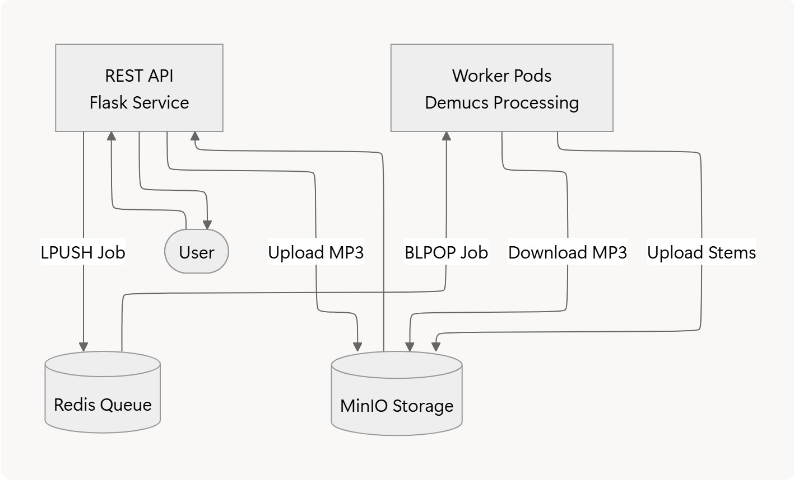

# 🎵 Music Separation as a Service (MSaaS)

Music Separation as a Service (MSaaS) is a Kubernetes-based microservice system that performs automatic music source separation.  
A REST API accepts MP3 uploads, tasks are queued using Redis, and worker pods run **Demucs** (Facebook AI Research) to separate audio into stems such as vocals, drums, bass, and others.  
Outputs are stored in MinIO object storage and made available for download.


---

## 🚀 Overview

This project demonstrates a cloud-native audio processing pipeline composed of:

- **REST Service** – Handles uploads, job creation, and result retrieval  
- **Worker Service** – Runs Demucs to separate audio into multiple tracks  
- **Redis** – Lightweight distributed queue for task management  
- **MinIO** – Stores uploaded MP3s and separated output stems  
- **Kubernetes** – Orchestrates all components for scaling and reliability  

---

## 🔧 Components

### REST API
- Accepts MP3 uploads  
- Stores files into MinIO (`queue/` bucket)  
- Pushes job metadata into Redis  
- Provides endpoints for checking job status and retrieving processed stems  

### Worker Service
- Listens for jobs in Redis  
- Downloads MP3 from MinIO  
- Executes Demucs to extract:
  - vocals  
  - drums  
  - bass  
  - other stems  
- Uploads output files to MinIO (`output/` bucket)

### Redis Queue
- Manages asynchronous tasks  
- Uses `LPUSH` for enqueue and `BLPOP` for workers  

### MinIO Storage
- S3-compatible object storage  
- Used to store both input MP3s and separated tracks  

---

## 🧰 Tech Stack

| Area | Technology |
|------|------------|
| API | Flask |
| ML Processing | Demucs |
| Task Queue | Redis |
| Storage | MinIO |
| Orchestration | Kubernetes |
| Containers | Docker |
| Cloud | Local K8s & GKE |

---
## System Architecture 


---

## ⚙️ Development & Deployment

### Start Local Redis & MinIO
```bash
./deploy-local-dev.sh

